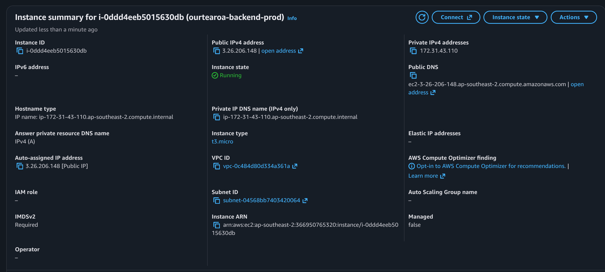
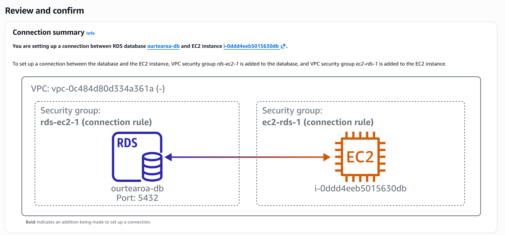
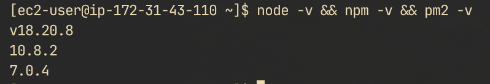
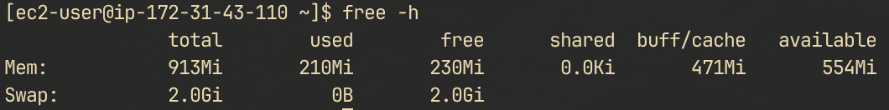
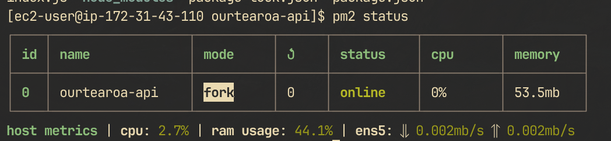
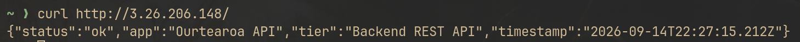
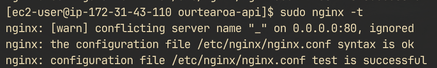

# Cloud Infrastructure Setup

## 1. AWS Provisioning
- **Instance Type:** `t3.micro`
- **OS:** Amazon Linux 2023




> **Note:** The RDS instance additionally needs its own inbound rule for TCP 5432. The EC2 security group does not cover it — see [aws-rds-setup.md](aws-rds-setup.md).

## 2. Dependencies & Runtime
- Node.js, npm, PM2, Nginx



## 3. Process Management
- Managed with PM2 configured for systemd startup.
- The `t3.micro` ships with 1 GB RAM, which Node can exceed. A swap file prevents the OOM killer from terminating the API process.



## 4. Reverse Proxy & Verification
- Nginx proxying port 443 -> 127.0.0.1:3000.





## 5. Test
- Confirm the API is up through the health endpoint, which returns `200` with a live `latencyMs` read from RDS:

```bash
curl -i http://<EC2-PUBLIC-IP>/api/health
```

```json
{
  "status": "UP",
  "timestamp": "2026-09-29T00:18:23.886Z",
  "database": "UP",
  "latencyMs": 34.9,
  "reason": null
}
```

- A `503` with `reason: "timeout"` means the EC2 instance is not covered by the RDS security group rule. A `503` with `reason: "unreachable"` means the connection was reached but the credentials or SSL settings are wrong.
- Because the API is started from `backend/`, the `sslrootcert=../global-bundle.pem` path resolves to the repo root. Ensure `global-bundle.pem` exists there on the server, and that `DATABASE_URL` is supplied by the process environment (systemd unit or PM2 ecosystem config) rather than a committed file.
